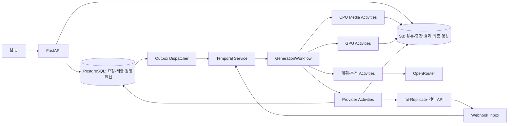

# Open Genjutsu 조사 및 구현 계획

조사일: 2026-10-08 (Asia/Seoul). 상태: 네트워크 허용 후 공식 제품·모델 카탈로그·API 스키마까지 확인한 설계 초안. 애플리케이션 구현과 유료 모델 호출은 아직 수행하지 않았다.

## 1. 결론

Genjutsu와 유사한 기능을 구현하려면 **영상의 움직임·장면을 유지하면서 선택한 인물이나 물체를 참조 이미지에 맞게 바꾸는 파이프라인**이 필요하다. 텍스트 프롬프트로 새 영상을 생성하는 기능만으로는 부족하다.

권장 출발점은 다음과 같다.

- 인물 모션·표정 전이 및 인물 교체: **Wan2.2-Animate-14B**.
- 선택 영역의 물체·의상·배경 편집: **VACE**.
- 대상 선택·추적: **SAM 2/2.1**, 인체 포즈 추출: Wan-Animate의 지원 전처리기 또는 DWPose 계열.
- 새 액션 생성: **Wan2.2 T2V/I2V**, **LTX-2 계열** 비교 평가.
- 프롬프트 작성 기본값: OpenRouter의 **Dolphin Mistral 24B Venice Edition**. 엄격한 실행 계획에는 **Hermes 3 70B**를 선택 가능하게 한다. 이미지 분석은 별도 Qwen3-VL 모델로 처리한다.
- 복잡한 액션·정교한 교체: **SCAIL-2 GPU 워커**를 주요 비교 후보로 추가. 상용 모션 전이 대안은 스키마가 확인된 **Kling v3 Motion Control**.

사용자는 자동 선택 또는 단계별 모델 직접 선택을 할 수 있어야 한다. 기본값은 태스크별로 정하며, 민감한 창작 프롬프트에 대한 수용성도 품질·비용과 함께 평가한다.

## 2. 조사 범위와 증거의 한계

네트워크 허용 후 Higgsfield 공식 Genjutsu 소개·가이드, OpenRouter 모델 목록·공급자 endpoint·모델 카드, fal의 실제 API 문서와 가격, Replicate의 페이지·임베디드 스키마를 읽었다. GitHub 웹 검색과 커뮤니티 가이드·Issues 조사도 포함했다.

Google 검색은 HTTP 200이어도 JavaScript 리다이렉트 페이지만 반환해 유효한 검색 결과로 쓰지 않았다. Bing 검색은 접근되지만 일부 질의에서 일반적인 제품 링크만 반환했다. Reddit는 HTML과 JSON 모두 HTTP 403이 계속 발생하므로 본문을 읽었다고 주장하지 않는다. 추가 네트워크 권한이 필요하다고 단정하지 않는다.

증거를 구분한다.

1. **공식 제품·API 문서에서 확인**: Genjutsu 기능/입력 한도, 모델 ID, 입력 필드, 문서상 가격·정책.
2. **커뮤니티 보고**: 사용 절차와 실패 사례. 재현 테스트 결과가 아니다.
3. **제안**: 우리 프로젝트의 구성, 기본값, 평가 기준.

Higgsfield 내부 모델은 공개 자료로 확인하지 못했다. 공식 홍보의 보존·품질 주장은 우리가 검증한 성능이 아니다. 모델 목록의 노출과 정상 유료 추론도 서로 다르다. 커뮤니티 가이드는 제휴 링크를 포함할 수 있어 보조 자료로만 사용한다.

## 3. Genjutsu에서 재현할 기능

Higgsfield 공식 페이지·가이드 [S15, S16]에서 다음을 확인했다.

- **Motion Transfer**: 원본의 동작·카메라·타이밍을 유지하며 참조에 맞춰 인물과 장면을 재구성.
- **Object Swap**: 인물·의상·제품·장소·물체 등 지정 요소를 변경하고 주변 쇼트를 유지.
- 입력 영상 1개, **4~30초**, 참조 이미지 **최대 30개**, 출력 **최대 1080p**.
- 프롬프트는 선택 사항이고 프리셋만으로도 실행 가능. 공식 가이드는 **30개 이상 프리셋**을 안내.
- 동일 설정에서 여러 버전을 생성하는 **Batch** 경험을 제공.

따라서 제품의 최종 범위에는 두 모드, 참조 역할, 프리셋, 배치 변형, 원본/결과 비교가 들어가야 한다. MVP에 처음부터 30개 참조와 1080p를 보장하지는 않는다.

공개 가이드 [S1, S2]는 원본 영상, 인물 참조 이미지, 선택적인 의상 참조, 교체 프롬프트를 사용하는 Object Swap 절차를 보여준다. 별도 구현 사례 [S3]는 motion transfer와 object swap을 명시한다.

가이드에서 사용자가 요구하는 보존 항목은 인물 위치, 동작, 표정, 손과 소품의 상호작용, 다른 인물, 배경, 카메라, 타이밍, 원본 음성이다. 이것은 **사용자의 기대**이며 모든 항목이 실제로 정확히 보존된다는 증거는 아니다.

| 기능 | 입력 | 기대 출력 | 우선순위 |
| --- | --- | --- | --- |
| 인물 교체 | 원본 영상 + 대상 선택 + 새 인물 이미지 | 원래 장면에서 대상 인물만 변경 | MVP |
| 모션 전이 | 동작 영상 + 새 인물 이미지 | 참조 인물이 원래 동작·표정을 수행 | MVP |
| 영역 편집 | 원본 영상 + 추적 마스크 + 이미지/지시 | 물체·의상 등 선택 영역 변경 | 다음 단계 |
| 액션 생성 | 이미지/텍스트 + 동작 지시 | 새로운 액션 영상 | 다음 단계 |
| 다인물 교체 | 인물별 참조 + 각 대상의 트랙 | 인물 간 정체성과 가림 관계 유지 | 후속 단계 |
| 얼굴·음성 애니메이션 | 얼굴 이미지 + 동작 영상/음성 | 표정 또는 발화 중심 영상 | 선택 확장 |

MVP 기본 시험 조건은 단일 인물, 한 쇼트, 약 5초, 480p 또는 모델이 지원하는 근접 해상도다. 720p, 긴 영상, 다인물, 큰 체형 변화는 후속 검증 대상으로 둔다. 이 조건은 우리 제품의 초기 범위이며 Higgsfield의 공식 제한이 아니다.

## 4. 태스크별 모델 조사

| 후보 | 문서로 확인한 특성 | 권장 역할 | 확인할 제한 |
| --- | --- | --- | --- |
| Wan2.2-Animate-14B [S4] | 영상+인물 이미지 입력, animation/replacement 모드, 움직임·표정 복제, 전처리와 replacement relighting 옵션 | 모션 전이·인물 교체의 1차 후보 | 다인물, 손·소품 접촉, 실제 메모리/속도, 제공 API의 지원 모드 |
| VACE [S5] | 참조 기반 생성, video-to-video, masked video-to-video의 조합; 영상·마스크·참조 이미지 전처리 | 물체/의상 편집, 제한된 영역 재생성 | 마스크 경계, 시간 일관성, 정체성 유지, 지원 체크포인트 |
| Wan2.2 T2V/I2V [S4] | 텍스트/이미지 기반 생성, 14B 계열과 5B TI2V 제공 | 새 액션·쇼트 생성 | 원본 동작의 정확한 복제와는 별도 태스크; 접촉·물리 일관성 평가 필요 |
| LTX-2 계열 [S6] | 동기화된 오디오·비디오 생성, 여러 파이프라인; 현재 README는 2.5 체크포인트도 안내 | 새 액션, 빠른 프리뷰/오디오 포함 생성 비교 후보 | 버전별 라이선스·제어 기능·GPU 요구량; API 제공 여부 |
| MimicMotion [S7] | confidence-aware pose guidance, 긴 영상용 latent fusion; README에 구체적 메모리/시간 사례 | 포즈 기반 전이의 비교 기준 | 기본 체크포인트는 SVD 의존; 가중치/기반 모델 라이선스를 별도 확인 |
| LivePortrait [S8] | 얼굴 애니메이션, stitching/retargeting; 드라이빙 영상의 얼굴 중심 구도를 권장 | 얼굴 클로즈업·표정 태스크 | 전신 액션용이 아님; 얼굴 검출 등 종속 가중치의 사용 조건 확인 |
| HuMo [S9] | 텍스트·이미지·음성 조건, 인물 보존과 오디오 연동 동작 | 발화·퍼포먼스 확장 | 원본 영상의 정확한 모션 전이와 구분; 다중 입력별 구현 지원 확인 |
| SAM 2/2.1 [S10] | 영상에서 promptable segmentation과 streaming memory | 대상 분할·시간별 추적 | 생성 모델이 아님; 가림·재등장 때 트랙 재확인 필요 |
| Kling v3 Motion Control [S24] | fal 공식 API는 이미지+영상+방향 설정, 원본 음성 유지, 얼굴 일관성용 element 1개 지원 | 상용 모션 전이 비교 후보 | 이미지 방향 최대 10초, 영상 방향 최대 30초; object swap 전용 모델로 취급하지 않음 |
| SCAIL-2 [S27] | end-to-end 영상/포즈 기반 전이, replacement 마스크, 프롬프트, 실험적 다중 참조, relighting LoRA | 복잡한 액션·정교한 대상 교체의 주요 GPU 후보 | 마스크 색상 의미와 정렬이 중요; hosted API는 이번 조사에서 확인하지 못함 |
| SteadyDancer [S28] | 첫 프레임 보존을 중심으로 한 인물 이미지 애니메이션, 포즈 조건, X-Dance 벤치마크 | 춤·운동 및 참조 이미지 보존 비교 후보 | 범용 물체 교체 모델이 아님; 첫 프레임 보존과 전체 영상 정체성 보존을 구분 |

Wan2.2 공식 README의 24GB 안내는 TI2V-5B의 특정 명령에 관한 것이다. 이를 Animate-14B의 요구량으로 재사용하면 안 된다. 실제 배포 체크포인트, dtype, 해상도, 프레임 수, offload 설정별로 측정한다.

VACE는 마스크 편집 기능이 있어도 원본 배경을 픽셀 단위로 보장하지 않는다. 강한 배경 보존이 필요한 경우 원본과의 합성이 필요하며, 체형 변경·새 그림자·새 물체가 마스크 밖까지 영향을 주면 보존 범위와 생성 범위 사이에 충돌이 생긴다.

## 5. 커뮤니티에서 얻은 구현상 시사점

- 사용자 가이드 [S1]는 처음에는 인물 하나만 바꾸고, 정체성 이미지와 의상 이미지를 별도 역할로 지정하며, 다른 인물·배경·카메라를 유지하라고 요청한다. UI에 참조 이미지의 역할을 명시해야 한다.
- 사용자 사례 [S2]는 복잡한 다인물 장면에서 참조 순서·정체성 지시와 재시도가 결과에 영향을 준다고 보고한다. 안정성이나 성공률을 정량적으로 제시한 자료는 아니다.
- WanVideoWrapper Issue #1699 [S11]는 특정 전처리 노드에서 다인물 얼굴이 동기화되지 않거나 얼굴 하나만 인식하는 문제를 보고한다. 모든 구현에 적용되는 결함이라는 증거는 아니지만, 단일 인물 MVP와 명시적인 인물별 트랙이 필요한 이유가 된다.
- 성공 사례의 썸네일만으로 모델을 선정하지 않는다. 우리 데이터셋에서 가림, 회전, 손 접촉, 빠른 동작을 직접 검증해야 한다.

## 6. OpenRouter 및 다른 API의 역할

2026-10-08에 읽은 OpenRouter `/api/v1/models` 응답 [S17]에는 465개 모델이 있었으며 `output_modalities`에 `video`가 포함된 모델은 **0개**였다. 이 시점의 카탈로그에 관한 관측이며, 향후 별도 영상 API가 생기지 않는다는 뜻은 아니다.

OpenRouter는 프롬프트 작성·작업 계획·지원 모델을 통한 이미지 분석에 사용한다. Dolphin/Hermes는 현재 **텍스트 전용**이다. 이미지 분석 후보 `qwen/qwen3-vl-32b-instruct`는 카탈로그상 text+image 입력을 지원한다. 샘플 프레임으로 분석하고 영상 전체를 직접 읽었다고 처리하지 않는다. 픽셀 마스크·정확한 포즈는 SAM/포즈 전처리기에서 얻는다.

### 확인된 API 능력과 중요한 제약

| 공급자/모델 | 입력 필드/지원 기능 | 설계에 반영할 제약 |
| --- | --- | --- |
| fal `fal-ai/wan/v2.2-14b/animate/replace` [S21] | `video_url`, `image_url`, seed, 480p/580p/720p, turbo, 프레임 ZIP | 입력에 **자유 프롬프트·외부 대상 마스크 없음**; 단일 인물 교체에 사용 |
| fal `fal-ai/wan/v2.2-14b/animate/move` [S22] | 영상+이미지, seed, 해상도, 프레임 ZIP | 입력에 **자유 프롬프트·외부 대상 마스크 없음**; 모션/표정 전이 |
| fal `fal-ai/wan-vace-14b` [S23] | `prompt`, `task`, `video_url`, `mask_video_url`, `mask_image_url`, `ref_image_urls`, 프레임/fps 매칭 | task는 depth/pose/inpainting/outpainting/reframe; 이미지 마스크가 있으면 영상 마스크가 무시됨 |
| fal `fal-ai/kling-video/v3/pro/motion-control` [S24] | 이미지+영상+프롬프트, `character_orientation`, `keep_original_sound`, `elements` | element는 1개, 영상 방향에서만 지원. 이미지 방향 최대 10초/영상 방향 최대 30초 |
| Replicate `wan-video/wan-2.2-animate-replace` [S25] | 임베디드 스키마의 `video`, `character_image`, `seed`, `resolution`, `go_fast`, `merge_audio` | `frames_per_second` 필드는 deprecated이며 **항상 30fps**라는 설명; 자유 프롬프트/마스크 없음 |
| GPU SCAIL-2 [S27] | `--image`, `--mask_image`, `--pose`, `--mask_video`, `--prompt`, `--replace_flag` | 제공자 API가 아니라 원격 워커로 감쌈. 프롬프트는 교체 명령이 아닌 **변경 후 장면 설명** |

Replicate의 소개 문구는 원본 fps 유지라고 설명하지만 실제 스키마는 30fps 고정을 명시한다. **스키마를 기준으로 구현하고 실제 출력 메타데이터로 다시 검증**한다. fal 문서 예제에도 입력 기본값과 예제 값, 출력 MIME의 불일치가 있어 복사한 예제를 곧바로 검증된 동작으로 취급하지 않는다.

### 어댑터 구성

- `OpenRouterAdapter`: 텍스트/이미지 입력 능력과 구조화 출력 능력을 공급자별로 확인.
- `FalAdapter`: 위 endpoint의 스키마를 각각 매핑. queue submit/status/result와 웹훅 지원.
- `ReplicateAdapter`: 별도 입력 이름과 출력 URL, 고정 fps를 매핑. 동일한 Wan 모델이라도 fal 입력을 그대로 보내지 않음.
- `OpenAICompatibleAdapter`: LLM base URL, 모델 ID, 인증 헤더 확장.
- `GPUWorkerAdapter`: SCAIL-2/Wan/VACE 공개 가중치의 버전 고정 워크플로. CPU API와 GPU 워커 분리.

OpenRouter 키 외에 영상 공급자 키 또는 GPU 워커가 필요하다. 이번 단계는 조사·계획이므로 키 등록과 유료 호출은 수행하지 않았다.

## 7. 기본 모델과 프롬프트 수용성

민감한 창작 프롬프트에 대한 수용성을 우선하되, **LLM의 성향과 영상 서비스의 필터를 따로 선택·평가**한다.

| 단계 | 초기 기본값 제안 | 확인한 근거와 남은 조건 |
| --- | --- | --- |
| 창작 프롬프트 작성 | `cognitivecomputations/dolphin-mistral-24b-venice-edition` | OpenRouter 판매 상태 확인, 모델 카드가 uncensored/사용자 steerability를 명시 [S17, S19]; 실제 거절률은 미측정 |
| 엄격한 실행 계획 JSON | `nousresearch/hermes-3-llama-3.1-70b` | DeepInfra endpoint가 `structured_outputs`를 명시 [S18]; 모델 카드도 JSON/사용자 제어 지향 [S20] |
| 샘플 프레임 분석 | `qwen/qwen3-vl-32b-instruct` | 이미지 입력 지원 [S17]; 수용성 우위는 아직 검증하지 않음 |
| 단일 인물 교체/모션 전이 | fal Wan-Animate replace/move | 실제 endpoint·스키마 확인; 요청/출력 정책과 결과 품질 검증 필요 |
| 선택 영역의 물체/의상 편집 | fal VACE-14B | 마스크·참조 입력 확인; 인물 정체성 보존 품질은 미측정 |
| 복잡한 액션/정교한 제어 | GPU SCAIL-2를 우선 비교 | 프롬프트·마스크·다중 참조 지원 [S27]; 배포 및 실측 후 기본값 확정 |
| 춤·참조 첫 프레임 보존 | SteadyDancer 비교 | 공식 설계 및 X-Dance 벤치마크 확인 [S28] |
| 상용 모션 품질 | Kling v3 선택형 | API 확인; 민감 프롬프트 기본값으로는 지정하지 않음 |

Dolphin은 `response_format`을 지원하지만 조사한 endpoint는 `structured_outputs`를 명시하지 않는다. 처음에는 사용자 지시를 서버에서 결정적으로 계획에 매핑하고, 필요한 프롬프트 작성에 Dolphin을 사용한다. 복잡한 계획은 Hermes의 엄격한 스키마 출력 경로를 선택한다. 두 LLM을 매번 연속 호출하지 않는다. `require_parameters: true` 및 허용 공급자 목록으로 선택 기능을 지원하는 endpoint에만 라우팅한다 [S29].

OpenRouter는 Dolphin/Hermes의 `top_provider.is_moderated=false`를 반환했다. 이것은 해당 메타데이터이며 모든 요청의 무조건적인 수용 보증은 아니다. Dolphin의 모델 카드·카탈로그 명칭과 실제 정책 적용도 구분한다.

fal Wan/VACE 스키마는 `enable_safety_checker` 설정 변경에 **계정 권한이 필요하며 미승인 요청은 항상 검사**한다고 명시한다. fal의 Trust & Safety 페이지 [S30]도 별도 moderation 운영을 설명한다. 사용 가능한 공식 설정과 계정 권한을 반영하며, 플래그가 있다는 이유로 hosted 영상의 수용성을 보장하지 않는다. 자체 GPU 워커는 공급자와 배포 정책을 직접 선택할 수 있는 확장 경로다.

`creative-open`을 초기 프로필로 하고 `balanced`, `quality`, `economy`도 제공한다. 각 프로필에는 실제 모델/제공자/버전을 공개한다. 최종 기본값은 공포·가상 액션·거친 언어·성인 주제 등 분류된 테스트에서 **LLM 거절**, **영상 API 차단**, **생성 실패**를 별도 집계해 결정한다.

제공자 거절은 사유를 그대로 표시하고 요청을 몰래 바꾸지 않는다. 기술 오류 재시도와 사용자 모델 변경을 구분한다. 데이터가 다른 공급자로 전송되는 fallback은 사용자가 설정한 범위 안에서만 수행한다.

## 8. 파이프라인과 모델 조합

### A. 인물 교체 — MVP

1. 영상 업로드, ffprobe로 길이·fps·해상도·음성·쇼트 경계 확인.
2. hosted Wan MVP는 한 인물 영상만 받는다. 대상 선택·마스크 검토는 VACE/SCAIL-2 경로에서 지원하며, 마스크를 못 받는 API에는 UI에서 해당 옵션을 노출하지 않는다.
3. 참조 이미지를 `identity`, `clothing`, `style`로 구분. 처음에는 정체성 참조 하나로 제한.
4. 기본 작업은 서버에서 결정적으로 계획을 작성한다. 복잡한 지시는 Hermes의 구조화 출력으로 `target_track`, `preserve`, `edit`, `model_preferences` JSON을 작성하고, Dolphin은 필요한 창작 프롬프트에 사용한다.
5. JSON schema와 실제 공급자 기능을 서버에서 검증. LLM이 직접 임의 URL이나 코드 실행을 결정하지 않는다.
6. Wan-Animate replace API로 실행한다. hosted 경로는 전처리를 공급자가 담당한다. 임의 대상 선택이나 자유 프롬프트가 필요한 작업은 VACE/SCAIL-2로 분리하고 Wan 입력으로 조용히 버리지 않는다.
7. 움직임·정체성·경계 검토. 강한 배경 보존 모드에서는 원본 프레임과 합성하되 체형 변화·그림자 범위를 확인.
8. 원본 음성을 재결합하고 다운로드 가능하게 저장.

### B. 모션 전이 — MVP

드라이빙 영상 + 참조 인물 → Wan-Animate move API → 동작 영상. 자체 GPU 경로에서는 지원 전처리기를 거친다. 복잡한 동작은 SCAIL-2, 춤·첫 프레임 보존은 SteadyDancer, 상용 모션 전이는 Kling v3와 비교한다.

원본 장면을 보존하는 A와 새 인물 이미지를 움직이게 하는 B를 UI에서 구분한다. 동작을 자유롭게 바꾸는 것과 원본 동작을 정확히 따르는 것은 다른 옵션이다.

### C. 물체·의상 편집 — 다음 단계

대상 마스크 추적 → VACE masked V2V + 참조 이미지/프롬프트 → 시간 일관성 확인 → 필요한 영역만 합성.

인물 정체성과 의상을 동시에 바꿀 때는 가능한 한 한 번의 생성으로 끝낸다. 여러 생성 모델을 연속 적용하면 얼굴과 시간 일관성이 누적해서 손상될 수 있다. 실패 영역에만 두 번째 편집을 적용하는 경로를 별도로 평가한다.

### D. 새로운 액션 — 다음 단계

LLM의 샷 계획 → Wan/LTX의 액션 생성 → 필요 시 인물 교체 → 검토 → 인코딩.

특정 동작의 정확도가 핵심이면 모션 참조 영상을 우선 사용한다. 텍스트로 생성한 액션 영상을 모션 소스로 쓰는 경로는 유용할 수 있지만 물리 오류가 후속 단계로 전파되므로 선택 기능으로 둔다.

### E. 다인물 — 후속 단계

인물별 track ID·참조·포즈 → 가림 순서/접촉 관계 → 개별 영역 생성 또는 다인물 지원 모델 → 합성. SCAIL-2의 실험적 다중 참조는 후보지만, 다중 참조 지원만으로 독립적인 다인물 ID 제어가 보장되지는 않는다.

단순히 한 명씩 반복 교체하면 앞 단계에서 만든 얼굴·손이 다시 변할 수 있다. 다인물 모델, 개별 영역 처리, 순차 편집을 동일 데이터로 비교한 뒤 선택한다.

## 9. Temporal 기반 아키텍처

장시간 실행·장애 복구·배치·취소를 **Temporal Workflow**로 관리한다. 상세 설계는 [Temporal 아키텍처](temporal-architecture.ko.md)에 정리했다. 외부 API와 CPU/GPU 작업은 Activity로 실행하며, 기존 Redis 작업 큐 역할은 Temporal Task Queue로 대체한다.

초기 구성: Next.js/TypeScript, FastAPI/Python, Temporal Python SDK, ffmpeg/ffprobe, PostgreSQL, S3 호환 저장소. Workflow, 외부 API, CPU 후처리, GPU 추론 작업자를 별도 Task Queue로 분리한다. 운영 기본 제안은 Temporal Cloud이며 로컬 dev server는 개발/검증용이다. 현재는 설계이며 배포하지 않았다.

- **GenerationWorkflow**: 입력 검증 → 계획 고정 → 전처리 → 모델 단계 → 후처리 → 저장/정산.
- **ModelExecutionWorkflow**: 예산 예약 → 제출/대조 → webhook 또는 durable timer 대기 → 결과 저장 → 정산.
- **BatchWorkflow**: 변형별 child를 제한된 동시성으로 실행하고 검증된 전처리 자산을 공유.
- **ReconciliationWorkflow**: 제출 응답 유실, 취소 미확인, 남은 외부 작업을 원장과 대조.

Temporal의 이력은 실행 복구의 기준, PostgreSQL은 요청 멱등성·공급자 제출·비용 원장, S3는 미디어의 기준이다. 미디어와 API 키는 Workflow payload에 넣지 않는다. Workflow에는 자산 참조와 고정된 계획/모델 버전을 전달한다.

`ModelRegistry`에는 기존 태스크·모달리티·길이/fps/해상도·마스크/포즈/음성·가격/정책 정보 외에 **외부 멱등성 키와 보존 기간, client ID로 작업 조회, 취소, webhook 인증 지원**을 기록한다. `submit/status/result/cancel/estimate` 어댑터는 공급자마다 실제로 지원하는 기능만 노출한다.

**Activity 재시도가 외부 API의 exactly-once 실행을 보장하지는 않는다.** 유료 제출은 안정적인 execution ID와 원장을 사용한다. 기본 제출 Activity/HTTP POST 자동 재시도는 끄고, 공급자의 멱등성 지원이 확인된 경로만 제한적으로 재시도한다. 응답이 유실되면 `SUBMISSION_UNKNOWN`으로 대조하며 기존 작업을 식별할 수 없으면 새 제출 없이 확인을 기다린다.

영상 API 대기는 긴 Activity polling 대신 짧은 상태 조회 Activity + Workflow durable timer + webhook Signal로 구성한다. CPU/GPU Activity는 heartbeat, 외부 checkpoint, 결과 manifest로 복구한다. heartbeat만으로 GPU 메모리나 ffmpeg 연산이 복원되지는 않는다.

취소 접수와 공급자 취소 완료를 구분한다. 일반 사용자 취소는 Workflow를 즉시 terminate하지 않고 다음 단계 중단·외부 취소·비용 정산을 진행한다. fallback은 기존 작업이 종료되었거나 제출되지 않았다는 확인과 추가 예산이 있을 때만 실행한다.

## 10. 평가 계획

평가용 원본 12개부터 시작한다: 기본 동작 3개, 빠른 액션 3개, 손/소품 접촉 2개, 가림/재등장 2개, 다인물 2개. MVP 합격 대상은 단일 인물 기본/빠른 동작이고, 나머지는 제한을 드러내는 진단용이다.

처음에는 3개 대표 클립 × 2개 주요 후보 × 1회 생성으로 비용을 제한한다. 유망한 경로만 전체 데이터와 반복 생성으로 확대한다. seed가 지원되지 않으면 seed 통제 비교라고 보고하지 않는다. 미지원 태스크에는 억지로 모델을 끼워 넣지 않는다.

| 평가 항목 | 측정 방법 |
| --- | --- |
| 모션 유지 | 입력/출력 포즈를 시간 정렬 후 정규화 비교; 가림 구간은 confidence와 함께 보고 |
| 정체성 유지 | 지원되는 얼굴/시각 임베딩 + 사람의 블라인드 검토; 비인간/스타일화 인물은 별도 기준 |
| 배경 보존 | 편집 영역과 경계를 제외한 영상 차이; 전역 재생성 모드는 픽셀 보존 경로와 구분 |
| 시간 일관성 | optical-flow 보정 후 변화, 의상·얼굴 flicker 검토 |
| 액션 품질 | 손·소품 접촉, 발 미끄러짐, 가림 후 재등장, 프레임별 신체 오류 검토 |
| 운영성 | 성공/실패/차단율, 대기·생성 시간, 청구 비용과 사용 가능한 결과당 비용 |
| 프롬프트 수용성 | 사전에 분류한 프롬프트의 LLM 거절과 영상 제공자 차단을 분리 |

MVP의 목표는 입력·대상·참조·모델 선택으로 실제 영상이 끝까지 생성되고, 원본 음성이 의도대로 결합되며, 서버 재시작 후 작업 상태를 복구하는 것이다. 품질 합격 수치는 파일럿 결과로 기준을 정한 뒤 전체 평가에 고정한다. 현재 문서에는 검증하지 않은 성공률·속도·가격을 쓰지 않는다. Temporal 도입에 따른 요청 시작 누락, 제출 응답 유실, 중복 과금, Worker 중단, 취소 경합과 이력 replay는 [장애 테스트 표](temporal-architecture.ko.md#12-구현-순서와-장애-검증)의 결과로 따로 평가한다.

## 11. 구현 순서와 완료 조건

Temporal의 복구 구조를 MVP부터 포함한다. 실제 단계별 작업과 장애 테스트는 [상세 설계의 구현 순서](temporal-architecture.ko.md#12-구현-순서와-장애-검증)를 따른다.

1. **사양·API 확인 — 문서 조사 완료**: Genjutsu 공식 기능, OpenRouter 판매 모델, fal/Replicate의 입력 능력과 비용을 확인했다. 실제 API 추론·권한·품질 확인은 다음 단계다.
2. **Temporal 수직 프로토타입**: 단일 인물 영상 업로드 → 접수 outbox → GenerationWorkflow → Wan replace/move 제출 원장 → durable 대기 → 결과 저장/음성 결합. 실제 3개 클립을 완료한다.
3. **장애 복구·멀티모델 실행기**: ModelExecutionWorkflow, OpenRouter 계획, provider adapter, 예산, webhook inbox, reconciliation. worker 중단·응답 유실·중복 이벤트·취소 경합을 장애 주입으로 검증한다.
4. **영역 편집·액션 확장**: VACE masked V2V, Wan/LTX 액션 경로, 실패 영역 재생성. 각각 별도 기능 테스트를 통과한 뒤 UI에 노출한다.
5. **기본값 선정**: 품질·비용·수용성 평가를 수행하고 `creative-open` 기본 모델 조합을 고정한다. 모델 이름뿐 아니라 제공자/버전도 기록한다.
6. **배치·다인물·긴 영상**: BatchWorkflow 동시성, 가림 관계, 쇼트 경계, 청크 연결, 정체성 유지, Continue-As-New 경계와 replay 호환성 검증. 단순한 청크 이어붙이기를 완성된 장편 지원으로 취급하지 않는다.

Genjutsu 내부 모델을 복제하는 것이 아니라 공개된 기능 목표를 독립 파이프라인으로 재현한다. 품질 동등성은 비교 데이터 없이 주장하지 않는다.

## 12. 비용, 환경 상태 및 남은 검증

### 문서상 가격 스냅샷 — 2026-10-08

| 경로 | 공개 가격 | 산정 시 주의 |
| --- | --- | --- |
| OpenRouter Dolphin Venice | 입력 $0.20 / 출력 $0.90, 각 100만 토큰 | 이미지 분석·영상 비용 별도 |
| OpenRouter Hermes 3 70B | 입력 $0.70 / 출력 $0.70, 각 100만 토큰 | 공급자/버전/가격 변동 가능 |
| fal Wan-Animate replace | 480p $0.04, 580p $0.06, 720p $0.08 / billed video second | **프레임 수 ÷ 16**으로 청구 초 계산 |
| fal VACE-14B | 480p $0.04, 580p $0.06, 720p $0.08 / billed video second | 동일하게 프레임 수 ÷ 16 |
| fal Kling v3 Pro Motion Control | $0.168 / 초 | 읽은 Playground 설정의 표시 가격; 옵션별 변화 확인 |
| Higgsfield 공식 비교 가격 | 15초 480p 40크레딧/약 $2, 720p 104/약 $5.20, 1080p 144/약 $7.20 | 공식 가이드의 September 2026 예시; 자체 구현 비용과 동일하지 않음 |

예: Wan replace를 5초·30fps·720p로 청구하는 프레임 수가 150이면 `150 / 16 × $0.08 = $0.75`다. 단순히 `5 × $0.08`로 계산하면 안 된다. VACE 81프레임·480p는 문서 공식상 `$0.2025`다. 실제 API가 채택하는 프레임 수, 반올림·최소 청구·재시도, 저장/전송, GPU 비용은 실측에서 확인한다. 위 값은 실제 청구 내역이 아니다.

### 환경과 남은 작업

사용자가 네트워크 권한을 허용한 뒤 Higgsfield, OpenRouter, fal, Replicate, Hugging Face 요청의 HTTP 200을 확인했다. 추가 도메인 초안은 이번 조사에서 저장하지 않았다. Reddit의 403은 계속되지만 다른 공식 자료 조사와 계획 작성에는 지장이 없다.

계획 단계에서 유료 생성이나 GPU 설치는 수행하지 않았다. 이전 인스턴스 검사에서는 `OPENROUTER_API_KEY`, `FAL_KEY`, `REPLICATE_API_TOKEN`이 없었다. 실제 구현·평가 때 현재 바인딩을 다시 확인하고 필요한 키만 환경 설정에서 받는다.

남은 검증은 자료 접근이 아니라 실제 실행과 품질이다.

- 단일 인물 3개 클립으로 Wan replace/move의 실제 출력·fps·음성·비용 확인.
- VACE 마스크 색상/시간 정렬/프레임 매칭과 target-only 보존 실험.
- SCAIL-2 워커 배포, 메모리/속도와 마스크 의미 검증; SteadyDancer 춤 비교.
- 선택한 LLM endpoint의 JSON 정확성 및 분류별 프롬프트 거절률 측정.
- 영상 공급자의 계정 권한·정책·차단률과 재시도 비용 확인.
- 체크포인트와 포즈·얼굴 검출 등 종속 가중치의 사용 조건 검토.

공식 문서와 스키마를 확인했으므로 구현에 사용할 모델 ID와 태스크 구분은 구체화되었다. 품질 동등성·완전한 프롬프트 수용성·30개 참조·1080p 동등 지원은 아직 검증되지 않았다.

## 13. 읽은 출처

- **S1 — 커뮤니티 사용 가이드**: https://github.com/moalmohtasib/genjutsu-one-character-guide 및 https://raw.githubusercontent.com/moalmohtasib/genjutsu-one-character-guide/main/index.html
- **S2 — 커뮤니티 캐릭터 교체 사례**: https://github.com/ashvibe/genjutsu-character-swap
- **S3 — 커뮤니티 Genjutsu 통합 사례**: https://github.com/shohamtal/genjutsu-studio
- **S4 — 공식 Wan2.2/Wan-Animate**: https://github.com/Wan-Video/Wan2.2
- **S5 — 공식 VACE**: https://github.com/ali-vilab/VACE
- **S6 — 공식 LTX-2**: https://github.com/Lightricks/LTX-2
- **S7 — 공식 MimicMotion**: https://github.com/Tencent/MimicMotion
- **S8 — 공식 LivePortrait**: https://github.com/KwaiVGI/LivePortrait
- **S9 — 공식 HuMo**: https://github.com/Phantom-video/HuMo
- **S10 — 공식 SAM 2**: https://github.com/facebookresearch/sam2
- **S11 — 다인물 전처리 관련 사용자 보고**: https://github.com/kijai/ComfyUI-WanVideoWrapper/issues/1699
- **S12 — 공식 OpenRouter SDK**: https://github.com/OpenRouterTeam/python-sdk
- **S13 — 공식 fal SDK**: https://github.com/fal-ai/fal
- **S14 — 공식 Hermes function-calling/JSON 예제**: https://github.com/NousResearch/Hermes-Function-Calling

- **S15 — 공식 Genjutsu 제품/FAQ**: https://higgsfield.ai/genjutsu
- **S16 — 공식 Genjutsu 가이드/가격**: https://higgsfield.ai/blog/higgsfield-genjutsu
- **S17 — OpenRouter 현재 모델 카탈로그**: https://openrouter.ai/api/v1/models
- **S18 — Hermes 3 70B 공급자 능력**: https://openrouter.ai/api/v1/models/nousresearch/hermes-3-llama-3.1-70b/endpoints
- **S19 — Dolphin 모델 카드**: https://huggingface.co/cognitivecomputations/Dolphin-Mistral-24B-Venice-Edition/blob/main/README.md 및 https://openrouter.ai/api/v1/models/cognitivecomputations/dolphin-mistral-24b-venice-edition/endpoints
- **S20 — Hermes 3 모델 카드**: https://huggingface.co/NousResearch/Hermes-3-Llama-3.1-70B/blob/main/README.md
- **S21 — fal Wan-Animate replace API/가격**: https://fal.ai/models/fal-ai/wan/v2.2-14b/animate/replace/api 및 해당 Playground
- **S22 — fal Wan-Animate move API**: https://fal.ai/models/fal-ai/wan/v2.2-14b/animate/move/api
- **S23 — fal VACE API/가격**: https://fal.ai/models/fal-ai/wan-vace-14b/api 및 해당 Playground
- **S24 — fal Kling v3 Motion Control API/가격**: https://fal.ai/models/fal-ai/kling-video/v3/pro/motion-control/api 및 해당 Playground
- **S25 — Replicate Wan replace 소개/스키마**: https://replicate.com/wan-video/wan-2.2-animate-replace/api/schema 및 해당 모델 README
- **S26 — fal Kling v2.6 Motion Control 비교 자료**: https://fal.ai/models/fal-ai/kling-video/v2.6/pro/motion-control/api
- **S27 — 공식 SCAIL-2 구현/마스크/프롬프트 지침**: https://github.com/zai-org/SCAIL-2
- **S28 — 공식 SteadyDancer**: https://github.com/MCG-NJU/SteadyDancer
- **S29 — OpenRouter 구조화 출력과 라우팅**: https://openrouter.ai/docs/features/structured-outputs 및 https://openrouter.ai/docs/features/provider-routing
- **S30 — fal Trust & Safety**: https://fal.ai/legal/trust-and-safety
- **S31 — Replicate 이용 정책**: https://replicate.com/terms

Reddit는 접근을 시도했지만 본문을 읽지 못했다. 커뮤니티 분석은 S1~S3 및 S11 등 실제로 읽은 GitHub 자료에 한정한다.

Temporal 설계 근거: 공식 [Python SDK](https://github.com/temporalio/sdk-python), [Retry Policies 문서 원문](https://github.com/temporalio/documentation/blob/main/docs/encyclopedia/retry-policies.mdx), [Python 예제](https://github.com/temporalio/samples-python). 직접 읽은 자료와 배포 한계는 [상세 설계](temporal-architecture.ko.md)에 명시했다.
