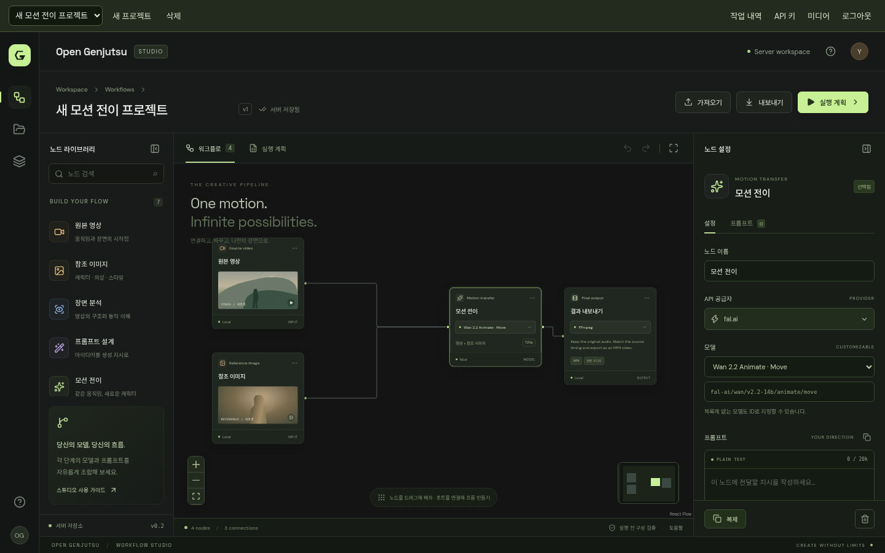
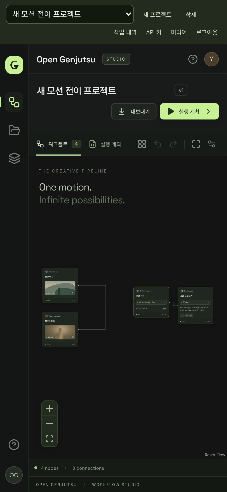

# 자체 호스팅 서비스 검증

검증일: 2026-10-08 (한국 시간). 대상은 Docker Compose로 실행한 Open Genjutsu 0.2.0이다. 실제 API, PostgreSQL, PostgreSQL에 이력을 저장하는 Temporal Server와 Worker를 구동했다. 유료 외부 요청은 제어 가능한 가짜 공급자를 사용했다.

## 로컬 실제 API 연결 준비 검증

`feat/local-testing`에서는 무료 로컬 영상 템플릿과 fal/Replicate 파일 업로드 경로를 추가했다. 프런트엔드 7개, API·업로드 38개, 실제 Temporal 7개, 서비스 브라우저 16개를 실행해 총 68개가 통과했다. 아래 기존 검증에서 API 8개와 Temporal 2개가 늘었으며, 기존 오프라인·릴리스·Compose 재시작 검사는 이 변경에서 다시 실행하지 않았다.

업로드 검사는 공급자 공식 계약에 맞는 가짜 응답으로 파일 스트리밍·중복 제거·Replicate multipart 필드·키 전달 범위·사설 IP 차단·VACE URL 치환을 확인한다. 실제 Temporal에서는 업로드 성공 후 생성 제출 1회, 업로드 실패 시 제출 0회와 `FAILED` 종료를 확인했다. 서비스 브라우저는 무료 템플릿 선택부터 실제 MP4 업로드·저장·실행·오디오 포함 다운로드를 확인했다.

실제 공급자에 유료 요청을 보내지는 않았다. 사용자가 본인 PC에서 총 $10 이내로 업로드·생성·품질·청구액을 확인한다. 공개 도메인은 기본 `upload` 경로에 필요하지 않다.

## 기존 서비스 자동 검사 결과

| 검사 | 통과 | 범위 |
| --- | ---: | --- |
| 프런트엔드 단위 검사 | 7 | 그래프 직렬화, 연결과 실행 계획 |
| API·보안·모델 입력 검사 | 30 | 로그인·CSRF·접근 제어, 키 암호화, 저장 충돌, 미디어·한도·중복 접수, 모델별 입력 범위·Kling 제출 payload, 관리자 운영 API |
| 실제 Temporal 통합 검사 | 5 | 로컬 영상 처리와 이력 replay, Worker 재시작, 접수 응답 유실과 복구, 취소, FFmpeg 재시도 |
| Compose 재시작 검사 | 1 | 실제 PostgreSQL에 대기 작업 저장, API·Worker 재시작 후 실행과 결과 유지 |
| 오프라인 편집기 브라우저 회귀 | 36 | 데스크톱·모바일 편집, 저장·가져오기·내보내기, 모달·키보드·접근성 |
| 서비스 브라우저 검사 | 16 | 로그인·저장·모델 입력 폼, 키 관리, 업로드·실행·다운로드, 관리자 운영 현황, 로그아웃·삭제 |
| 릴리스·배포 계약 검사 | 19 | 버전·이미지·롤백·백업 계약, reviewer 없는 게시 차단과 main 정책, Tunnel Compose 선택 |
| **합계** | **114** | 서로 다른 테스트 실행의 합계 |

TypeScript 빌드, Python Ruff 검사, Compose 구성 검사와 Docker 이미지 빌드도 통과했다. 실제 서비스 DB에 Alembic migration 0001~0003을 적용했다. TestClient 의존성의 deprecation 경고는 남아 있다.

브라우저 검사는 Playwright와 시스템 Chromium으로 수행했다. 서비스 화면은 1440×900 데스크톱과 Pixel 7 크기의 모바일 에뮬레이션에서 검증했다. 편집기와 API 키 대화상자의 검사 대상 상태에서 axe WCAG A/AA 위반은 없었다. 이는 전체 서비스의 접근성 인증을 의미하지 않는다.

## 장애와 실제 결과 확인

- 같은 실행 요청 키를 다시 제출하면 같은 작업을 반환한다.
- Worker를 중지한 상태에서 접수한 작업이 API 재시작 후에도 남고, Worker를 시작하면 완료된다.
- 외부 제출 응답을 잃으면 자동 재제출하지 않는다. `NEEDS_REVIEW`로 보관한 뒤 검증된 접수 ID로 복구해도 공급자 POST 횟수는 1회다.
- 공급자 취소 요청 후 최종 상태를 기다리며, 결과가 확정되기 전 성공으로 표시하지 않는다.
- 안전한 로컬 FFmpeg 처리는 일시 실패 후 재시도된다. 유료 제출에는 같은 재시도 정책을 적용하지 않는다.
- 실제 MP4를 업로드해 Temporal과 FFmpeg로 처리하고, 원본 오디오가 포함된 MP4를 다운로드했다. 서비스 재시작 후에도 다운로드할 수 있었다.

## 백업과 운영

`scripts/backup.sh`를 실제 실행해 활성·확인 대기 작업 검사, 쓰기 프로세스 중지, 애플리케이션·Temporal DB dump, 미디어와 환경 설정의 묶음 보관, 서비스 재시작을 확인했다. 백업에는 비밀 키가 있으므로 저장소에 포함하지 않는다.

`restore_drill.py`로 같은 호스트의 새 격리 프로젝트·빈 볼륨에 전체 묶음을 복원했다. 미디어 22개의 크기·SHA256, 저장 키 10개의 복호화, 작업 기록 11개, 완료 Temporal 이력 1개의 replay를 검증했다. 복원 후 새 로컬 작업 1개를 실행해 결과 다운로드와 오디오를 확인했으며 복원~검증은 약 40초였다. 이 시간은 작은 테스트 백업의 수치이며 별도 물리 호스트의 운영 RTO가 아니다. 원래 서비스와 볼륨을 변경하지 않고 격리 프로젝트만 제거했다. 복호화한 키는 테스트용 키이며 실제 유료 키가 아니다.

`service_probe.py`로 사용자 3명·각 2개 작업을 동시 실행했다. 6개 모두 완료, 같은 접수 키 6번 재요청은 같은 작업, 출력 6개 모두 영상·오디오 유지였다. 계정별 두 작업 묶음의 P95는 약 3.2초이며 대규모 처리량 벤치마크가 아니다. 유료 호출은 0회다.

## 확인하지 않은 범위

OpenRouter 공개 모델 목록과 fal Kling/VACE 입력 schema는 확인했다. 실제 유료 생성 품질·과금, 공개 HTTPS와 Tunnel 연결, 별도 호스트 복원, 대규모 부하와 다중 호스트 HA는 아직 검증하지 않았다. Cloudflare Compose는 구성 검사를 통과했고 이미지 digest를 고정했으나 실제 Tunnel 토큰·도메인이 없어 접속 성공으로 기록하지 않는다. 실제 모델 평가의 승인 비용은 총 $10이며 아직 사용하지 않았다. 모바일은 Chromium 에뮬레이션으로 실제 iOS Safari·Firefox 검사는 포함하지 않는다.

기존 서비스 PR #2와 릴리스 체계 PR #1은 CI 통과 후 main에 병합했다. GitHub release Environment와 main 보호 변경은 현재 연결 권한에서 403으로 차단됐고 운영자 설정이 필요하다. 릴리스 워크플로는 reviewer·main 정책을 확인할 수 없으면 게시를 중단한다. 실제 태그·RC·Release·외부 배포는 아직 생성하지 않았다.

자세한 배포·복구 절차는 [운영 가이드](operations.ko.md), 지원 입력은 [공급자 계약](provider-contract.ko.md)을 따른다.

## 화면 기록

