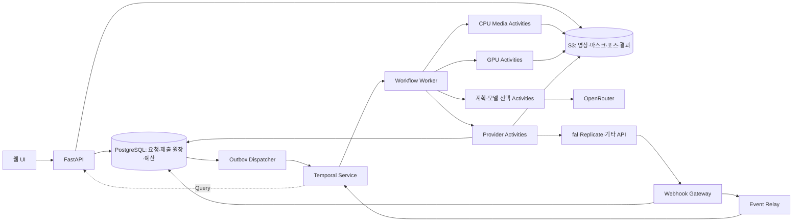
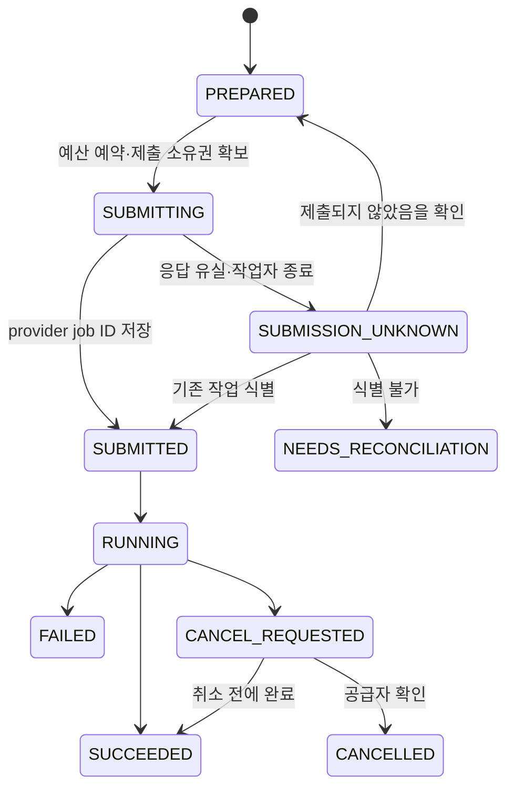

# Temporal 기반 Open Genjutsu 아키텍처

작성일: 2026-10-08 (Asia/Seoul). 상태: 설계. Temporal 배포와 장애 복구 테스트는 아직 실행하지 않았다.

## 1. 설계 결정

영상 생성의 실행 제어를 **Temporal Workflow**에 맡긴다. API 서버는 요청을 접수하고 상태를 제공하며, Workflow가 전처리·모델 실행·대기·후처리·정산의 순서를 관리한다. 외부 API, DB, 저장소, ffmpeg, GPU 추론은 **Activity**로 실행한다.

기존 Redis 작업 큐는 이 역할에서 제외한다. 초기 필수 구성은 Next.js, FastAPI, Temporal, Python Worker, PostgreSQL, S3 호환 저장소다. Redis는 나중에 캐시가 필요할 때 선택적으로 추가한다.

**Temporal이 보장하는 복구와 외부 생성 API의 중복 실행 방지는 별도로 설계한다.** Activity는 재실행될 수 있고, 타임아웃이 발생해도 공급자 작업이 중단됐다는 뜻은 아니다. Temporal만으로 유료 API의 exactly-once 실행이나 중복 과금 방지를 보장하지 않는다.

## 2. 전체 구성

| 컴포넌트 | 책임 |
| --- | --- |
| FastAPI | 인증·권한, 업로드 확인, 요청 접수, 취소/변형 요청, UI 조회 |
| Temporal Service | 실행 이력, Task Queue, durable timer, Signal/Update, 재시도 스케줄링 |
| Workflow Worker | 결정적인 실행 순서, 분기, 대기, 단계별 결과 참조 |
| Provider Worker | 외부 제출·조회·결과 다운로드·취소, 공급자별 입력 매핑 |
| CPU Media Worker | ffprobe, 프레임 추출, 인코딩, 합성, 음성 결합 |
| GPU Worker | SAM/포즈 추출, SCAIL-2/Wan/VACE 자체 추론 |
| PostgreSQL | 제품 메타데이터, 요청 멱등성, 제출 원장, 예산 예약/정산, outbox/inbox |
| S3 호환 저장소 | 원본과 모든 중간/최종 자산. Workflow에는 객체 참조만 전달 |

Temporal은 실행 상태의 기준이다. PostgreSQL의 작업 상태는 UI용 조회 모델이며, 공급자 제출·예산 원장은 외부 부작용의 기준이다. 이 역할을 분리해 두 저장소가 각자 다음 단계를 진행하는 충돌을 피한다.

## 3. Workflow 단위

### GenerationWorkflow — 사용자 요청 한 건

입력은 `tenant_id`, `generation_id`, 원본/참조 asset ID, 사용자 지시의 참조, 계획 버전, 모델 설정 버전, 비용 상한이다.

1. 입력 자산 존재·체크섬·영상 메타데이터 검증.
2. 기본 요청은 결정적인 규칙으로 계획 작성. 복잡한 지시는 OpenRouter Activity로 작성하고 결과를 고정.
3. ModelRegistry의 **버전이 고정된 스냅샷**으로 태스크/입력 능력/가격 검증.
4. CPU/GPU Activity로 필요한 전처리 실행.
5. 모델 단계마다 ModelExecutionWorkflow 실행.
6. 산출물 검사, 합성, 원본 음성 결합, 결과 manifest 저장.
7. 제품 상태와 예산 정산을 멱등하게 반영.

Wan replace/move에는 프롬프트·외부 마스크를 보내지 않는다. 대상 마스크가 필요한 계획은 VACE/SCAIL-2 경로로 선택한다. Temporal을 넣어도 모델 자체의 입력 제약은 달라지지 않는다.

### ModelExecutionWorkflow — 모델 단계 하나

`reserve_budget → prepare_submission → submit_or_reconcile → wait_for_provider → persist_result → settle_budget`를 담당한다. 공급자, 모델 버전, seed, 입력 해시, 논리적 execution ID를 고정한다.

모델별 실행 child를 두면 일부 단계의 실패와 운영 추적을 분리할 수 있다. child 자체에 무조건적인 전체 재시도를 설정하지 않는다. 실행 중인 공급자 작업을 추적하는 동안 parent가 닫히지 않도록 한다. timeout/terminate 등 비정상 종료 뒤 남은 작업은 원장 기반 ReconciliationWorkflow가 추적한다.

### BatchWorkflow / ReconciliationWorkflow

- BatchWorkflow는 변형별 GenerationWorkflow를 제한된 동시성으로 실행한다. 같은 원본의 검증된 전처리 자산은 공유하며 각 변형의 비용과 실패를 별도 기록한다.
- ReconciliationWorkflow는 `SUBMISSION_UNKNOWN`, 취소 확인 대기, 원장에만 남은 provider job을 조회한다. 주기적인 Temporal Schedule과 필요 시 즉시 실행을 함께 사용한다.
- 긴 배치/추적은 안전한 단계 경계에서 Continue-As-New를 사용한다. 실행 ID, 진행 포인터, 예산/원장 참조를 전달하며 처리 중인 Signal/Update 핸들러가 끝나기 전에 넘어가지 않는다. 전환 시 살아 있는 child가 누락되거나 중복 시작되지 않게 child 경계를 명시한다.

## 4. 요청 접수와 시작 누락 방지

클라이언트는 `Idempotency-Key`를 보낸다. DB에서 `(tenant_id, idempotency_key)`를 unique로 하고 요청 body 해시를 저장한다. 같은 키·같은 내용은 기존 generation을 반환하고, 같은 키·다른 내용은 충돌로 응답한다.

한 DB 트랜잭션에서 generation과 `START_WORKFLOW` outbox를 저장한다. API는 접수 ID를 반환한다. Dispatcher가 안정적인 `workflow_id = gen/{tenant_id}/{generation_id}`로 Temporal 실행을 시작하고 outbox를 완료한다.

Dispatcher가 start 성공 후 죽으면 같은 ID로 재시도한다. **종료된 Workflow까지 포함해 기존 ID 재사용을 거부하는 정책**을 설정하고 기존 실행 존재 여부를 확인해 outbox를 마무리한다. Temporal의 이력 보존 기간 이후에도 중복을 막는 기준은 DB의 요청 ID다. 의도적인 새 생성은 새로운 generation/execution ID와 비용 예약을 사용한다.

start outbox의 자동 재처리 기간은 Temporal 이력 보존 기간보다 짧게 둔다. 그 기간을 넘긴 미확인 항목은 DB의 실행/완료 기록과 제출 원장을 대조하고 확인 대기로 전환한다. 이력이 만료돼 기존 Workflow를 조회할 수 없다는 이유로 같은 생성을 새로 시작하지 않는다.

## 5. 외부 제출과 중복 과금 방지

`provider_executions`에 논리적 `execution_id`, 요청 해시, 공급자, 모델 버전, 상태, provider job ID, 예약 비용, 실제 청구 정보를 저장한다. 실행 ID는 Activity attempt나 Temporal run ID로 만들지 않는다. run 변경과 재시도에서도 같아야 한다.

1. 제출 준비와 예산 예약을 DB 트랜잭션으로 처리한다. 동일 execution은 unique constraint/CAS로 보호한다.
2. provider job ID가 이미 있으면 신규 POST 대신 기존 작업을 조회한다.
3. 공급자가 문서로 보장하는 idempotency key를 지원하면 동일 키·동일 요청을 사용한다. 키의 보존 기간과 재시도 허용 기간도 확인한다. 이를 넘으면 같은 키라도 무조건 재제출하지 않는다.
4. 멱등성 보장이 없는 제출 Activity는 `maximum_attempts=1`로 둔다. HTTP 클라이언트의 POST 자동 재시도도 끈다.
5. POST 이후 응답 유실, Temporal timeout, worker crash는 제출 실패로 단정하지 않는다. `SUBMITTING` 상태를 원장 대조 후 `SUBMISSION_UNKNOWN`으로 처리한다.
6. client correlation ID로 조회할 수 있으면 기존 작업을 찾는다. 확인할 수 없으면 `NEEDS_RECONCILIATION`으로 멈추고 예산을 유지한다. worker lease 만료는 신규 제출의 근거가 아니다.

DB와 공급자 API 사이에는 원자적 트랜잭션이 없다. **외부 멱등성이나 작업 식별 수단이 없으면, 성공한 POST의 응답을 잃은 구간을 자동으로 완전히 해결할 수 없다.** 이 경우 중복 생성보다 확인 대기를 택한다. UI에는 '공급자 접수 여부 확인 중'이라고 표시한다.

OpenRouter LLM 호출도 유료 부작용이다. 기본 짧은 계획은 규칙으로 작성하고, 실제 LLM 호출은 응답 저장/비용 상한을 둔다. 결과가 없는 응답 유실을 다시 호출할지는 별도 예산 정책으로 명시한다.

## 6. 외부 영상 생성 대기

공급자 submit과 status 확인은 짧은 Activity로 나눈다. 수십 분 동안 Worker의 Activity 슬롯을 붙잡아 polling하지 않는다.

- Workflow는 terminal webhook Signal 또는 **durable timer**로 깨어난다.
- webhook이 없거나 늦으면 짧은 status Activity로 확인한다. 초기 polling은 10초, 이후 30~60초 등 공급자 제한에 맞춰 조정한다.
- webhook은 힌트다. terminal 이벤트 뒤에는 공급자 조회나 검증된 결과 자산으로 최종 상태를 확인한다.
- polling 오류가 나도 provider job ID를 유지한다. 실패 Activity를 재시도해 기존 작업을 계속 조회한다.

Webhook Gateway는 공식 공급자 방식으로 서명/인증을 검증하고 수신 이벤트를 durable inbox에 저장한다. 서명 검증을 지원하지 않는 공급자는 신뢰되지 않은 힌트로 취급하고 API 조회로 확인한다. Event Relay가 Signal 전달 후 처리 여부를 기록한다. 중복과 역순 이벤트를 허용하며, 이벤트 ID 또는 body 해시로 중복 제거한다.

provider job ID가 DB에 저장되기 전에 webhook이 도착할 수 있으므로 미매칭 이벤트도 저장하고 나중에 연결한다. webhook 수신 200 응답만으로 Signal까지 전달됐다고 가정하지 않는다. 취소나 완료된 workflow로 온 이벤트는 원장 대조로 처리한다.

## 7. Activity 실행 정책

다음 값은 초기 설계값이며 실제 모델/서비스 지연을 측정한 뒤 조정한다.

| Activity | timeout/retry 방향 | 복구 방식 |
| --- | --- | --- |
| 자산 검증·메타데이터 조회 | Start-to-Close 30초, 최대 3회, 총 제한 2분 | 같은 asset revision 재조회 |
| 외부 유료 제출 | Start-to-Close 60초, 기본 1회 | 원장 reconciliation; 멱등성 확인된 공급자만 제한적 retry |
| provider status GET | Start-to-Close 15초, 최대 3회, 총 제한 1분 | 같은 job ID 조회, 장기 오류는 Workflow timer로 backoff |
| CPU/GPU 전처리·추론 | 작업별 Start-to-Close와 전체 deadline, heartbeat timeout 60초 | 10초 안팎 heartbeat + manifest/checkpoint; 재실행 가능 단계만 retry |
| 결과 다운로드·후처리 | 분 단위 작업별 timeout, 최대 3회 | checksum 확인, 임시 객체와 완료 manifest 구분 |
| DB 정산·상태 투영 | 짧은 timeout, 제한적 retry | unique execution ID로 중복 정산 방지 |

Start-to-Close는 시도 한 번, Schedule-to-Close는 큐 대기·재시도를 포함한 Activity 전체 상한이다. 서비스 작업 전체 deadline은 별도의 Workflow timer로 관리한다. Schedule-to-Start timeout을 제출 실패로 해석해 다른 공급자로 급히 재제출하지 않는다.

잘못된 입력, 인증 오류, 모델 미지원, 정책 거절은 재시도 불가 오류로 분류한다. 429·일시적 네트워크 오류는 안전한 GET/멱등 작업에만 backoff를 적용한다. 전체 Workflow의 자동 재시도는 기본으로 사용하지 않는다.

heartbeat는 Activity가 살아 있다는 신호와 작은 checkpoint 참조를 남긴다. **ffmpeg/GPU 연산의 메모리 상태를 자동으로 복원해 주지는 않는다.** chunk/프레임 범위와 완료 자산을 외부 저장소에 기록해야 실제로 이어서 처리할 수 있다. timeout된 Activity가 아직 돌아가는 경우도 있어 로컬 프로세스 supervisor, 작업 식별, 종료 확인과 아티팩트 원자적 게시를 둔다.

## 8. 작업자 분리와 예산

Task Queue는 `genjutsu-orchestrator`, `genjutsu-provider`, `genjutsu-media-cpu`, `genjutsu-gpu-{pool}`로 나눈다. Workflow Worker는 GPU 라이브러리나 ffmpeg를 직접 호출하지 않는다. 별도 GPU 큐를 통해 VRAM과 모델별 동시성 한도를 지킨다.

큐 분리만으로 공급자 전체 rate limit을 보장할 수는 없다. 여러 Worker가 공유하는 공급자 슬롯·rate token·예산 예약을 원자적으로 관리한다. 초기에는 PostgreSQL 원장/lease를 사용하고, 규모가 커지면 dedicated quota workflow나 rate-limit 서비스로 확장한다.

배치에서는 진행 중인 자식 수에 상한을 둔다. Workflow 내부 semaphore는 한 Workflow의 병렬성만 제어하므로 사용자 전체/공급자 전체 한도의 대체물이 아니다. 접수 여부가 불명확한 작업은 quota와 예상 비용에서 성급히 제외하지 않는다.

fallback은 이전 시도가 확실히 끝났거나 제출되지 않았고 추가 비용이 허용될 때만 실행한다. 정책 거절, 미확인 제출, 단순 status timeout을 이유로 자동 모델 변경하지 않는다.

## 9. 취소와 사용자 조작

- `request_cancel` Update: 취소 요청 접수와 현재 상태를 반환한다. 접수와 외부 작업 취소 완료를 구분한다.
- `provider_event` Signal: webhook 이벤트 참조 전달.
- `get_progress` Query: 현재 단계, provider job 참조, 완료 아티팩트, 대기 사유를 조회한다. Query는 외부 I/O나 상태 변경을 하지 않는다.
- 배치 변형 추가나 설정 변경은 검증되는 Update 또는 새 generation으로 처리한다. 이미 제출한 실행의 모델·입력을 중간에 바꾸지 않는다.

사용자의 일반 취소는 Workflow를 즉시 terminate하지 않는다. 다음 단계를 중단하고 가능한 provider cancel Activity를 호출하며 `CANCEL_REQUESTED` 상태로 완료/취소를 확인한다. 공급자가 취소를 지원하지 않으면 '진행 중 생성은 중단할 수 없음'을 표시하고 남은 단계를 실행하지 않는다. 추적과 정산은 계속한다.

취소와 provider 완료가 경합하면 둘 다 기록하고 신규 생성을 막는다. 취소 요청이 접수됐다고 이미 발생한 비용을 환불했다고 표시하지 않는다. 예산 예약은 공급자 최종 결과/정책에 따라 정산한다. 운영자의 강제 terminate는 최후 수단이며 원장의 잔여 작업을 reconciler가 처리한다.

## 10. 데이터·이력·버전 관리

Workflow 이력에는 영상 bytes, 전체 프레임, API 키, 만료되는 signed URL을 넣지 않는다. `asset_id`, 객체 key, revision, checksum 등 작은 참조를 사용하고 Activity 실행 때 필요한 URL을 발급한다. 입력/결과는 버전별로 불변으로 저장한다.

Workflow에서 파일 I/O, HTTP, DB, 일반 시간/난수, 실시간 ModelRegistry 조회를 하지 않는다. 필요한 값은 입력 또는 Activity 결과로 고정한다. 모델 변경은 계획 revision과 새로운 execution ID로 기록한다.

아티팩트 키에는 입력 해시·모델/전처리 버전·seed를 포함한다. 임시 업로드 후 checksum·영상 메타데이터 검증이 끝난 결과만 완료 manifest로 게시한다. 재시도는 manifest를 확인하고 유효한 결과를 재사용한다. GPU 구현과 CUDA 환경 변경도 cache key에 반영한다.

사용자 프롬프트·얼굴 데이터·결과 URL을 Search Attributes나 일반 로그에 넣지 않는다. 필요한 Workflow payload는 암호화 codec/data converter를 사용하고 접근·보존 기간을 설정한다. 실제 개인 자산은 S3/DB에서 따로 삭제하며 Temporal 이력 보존도 별도로 관리한다.

초기 롤아웃은 `GenerationWorkflowV1/V2`와 해당 Worker 버전을 구분하고, 진행 중인 V1을 처리할 Worker를 유지한다. 이력을 재생하는 Replayer 테스트를 배포 전에 통과시킨다. SDK/서버 버전 호환성을 확인한 뒤 Worker Versioning을 도입할 수 있다. Continue-As-New에서도 동일한 요청/논리 실행 ID와 제출 원장을 유지한다.

## 11. 배포·관측

로컬 개발은 Temporal CLI dev server와 Worker, PostgreSQL, S3 호환 저장소를 사용한다. dev server는 운영용으로 쓰지 않는다. 운영 기본 제안은 **Temporal Cloud + 우리가 운영하는 API/Worker/DB/S3**이며, 자체 호스팅은 HA·persistence·백업·업그레이드를 담당할 운영 역량이 필요할 때 선택한다.

Temporal 서비스/Worker 연결에 TLS와 namespace 접근 제어를 둔다. Temporal이 중단되면 신규 단계 진행이 지연된다. 기존 공급자 작업은 계속될 수 있으므로 webhook inbox를 저장하고 서비스 복구 후 relay/polling으로 대조한다. 서비스 데이터 손실까지 Worker replay가 해결해 주는 것은 아니며 persistence 백업과 복구 계획이 필요하다.

지표: Task Queue 대기 시간, Activity 재시도/heartbeat timeout, Workflow 실패/대기 시간, `SUBMISSION_UNKNOWN` 수와 체류 시간, orphan provider job, 사용자당 예약/실제 비용, 모델별 성공·차단률. `generation_id → workflow_id → execution_id → provider_job_id`로 추적한다.

## 12. 구현 순서와 장애 검증

1. **Workflow 기반 수직 MVP**: 접수 outbox, GenerationWorkflow, Wan 제출 원장, durable polling, 결과 S3, 원본 음성 결합. 실제 생성 3개 클립 검증.
2. **장애 복구**: worker/API 재시작, 요청 중복, webhook 누락/중복/역순, 제출 응답 유실, 취소·완료 경합. 가짜 provider로 자동 검증한 뒤 실제 API 최소 호출로 확인.
3. **태스크 확장**: VACE 마스크 편집, SCAIL-2 GPU Activity, checkpoint와 비용 통제, BatchWorkflow.
4. **운영 준비**: replay 테스트, 기존 Workflow와 새 Worker 롤아웃, 접근 제어, payload 보호, quota, 복구·관측.

| 장애 주입 | 기대 결과 |
| --- | --- |
| 접수 DB commit 직후 API 종료 | outbox에서 같은 Workflow 한 건이 시작됨 |
| provider가 접수했는데 응답 유실 | 기존 job 식별 또는 확인 대기; 새 유료 제출 없음 |
| provider job ID 저장 직후 Worker 종료 | 기존 ID를 이어 조회; POST를 반복하지 않음 |
| webhook 누락·중복·역순 | polling으로 복구, 완료 상태 역행·중복 정산 없음 |
| ffmpeg/GPU Worker 중단 | 검증된 checkpoint/manifest 재사용 또는 해당 Activity만 재실행 |
| Activity timeout 이후 오래된 시도가 완료 | 결과 manifest/원장 경쟁을 제어해 중복 게시·정산 방지 |
| 취소 직후 공급자 성공 응답 | 취소 의도·실제 결과·비용을 각각 기록, 다음 생성 중단 |
| 이전 모델 제출이 불명확한 상태에서 fallback | 신규 모델을 제출하지 않음 |
| Temporal 서비스 잠시 중단 | 외부 결과는 inbox/원장에 보존, 복구 후 대조 |
| 신규 Workflow 코드 배포 | 저장된 V1 이력 replay 통과, 진행 중 작업 유지 |

Workflow 테스트는 Temporal Python SDK의 time-skipping 환경을 사용하고, Worker kill·DB 장애·서비스 중단은 실제 통합 환경에서 테스트한다. SDK는 time-skipping 테스트 서버의 플랫폼 제한을 명시하므로 실행 호스트 지원 여부를 확인한다. 실제 재시도/결과 복구/외부 제출 횟수를 검증하며 테스트 명령 성공만으로 복구를 주장하지 않는다.

## 13. 확인한 공식 자료

- Temporal Python SDK: https://github.com/temporalio/sdk-python — Workflow 결정성, Activity, heartbeat/cancellation, Signal/Update/Query, 테스트와 Replayer.
- Temporal Retry Policies 공식 문서 원문: https://github.com/temporalio/documentation/blob/main/docs/encyclopedia/retry-policies.mdx — Activity의 기본 자동 재시도, Workflow 전체 재시도와의 차이.
- Python SDK RetryPolicy 구현: https://github.com/temporalio/sdk-python/blob/main/temporalio/common.py
- 공식 Python 예제: https://github.com/temporalio/samples-python 및 https://github.com/temporalio/samples-python/tree/main/encryption
- 공식 CLI: https://github.com/temporalio/cli

temporal.io/docs.temporal.io는 현재 환경에서 프록시 403이 발생했다. 위 공식 GitHub 자료와 문서 원문으로 설계를 확인했으며, 서비스 배포·계정 연결이나 성능 검증을 수행한 것은 아니다.
